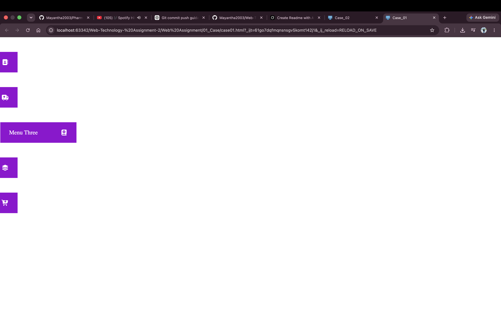
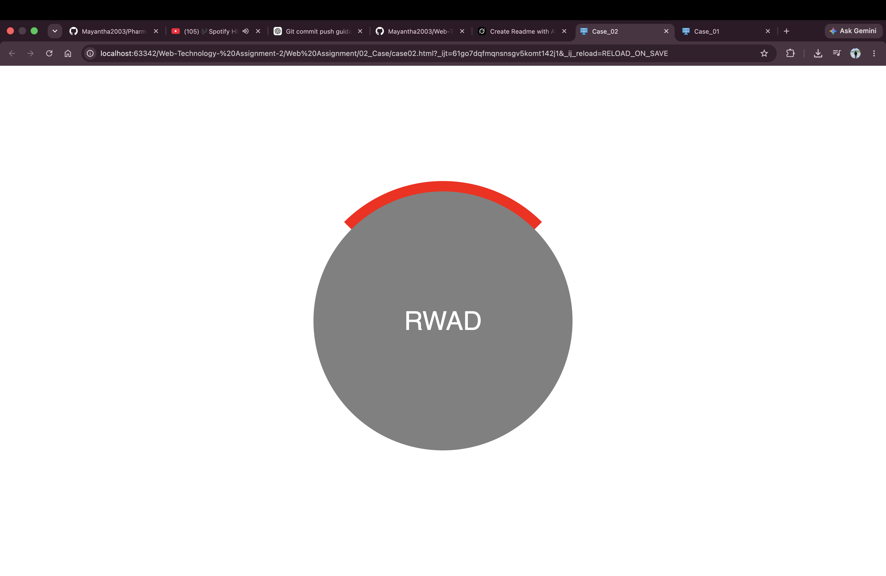
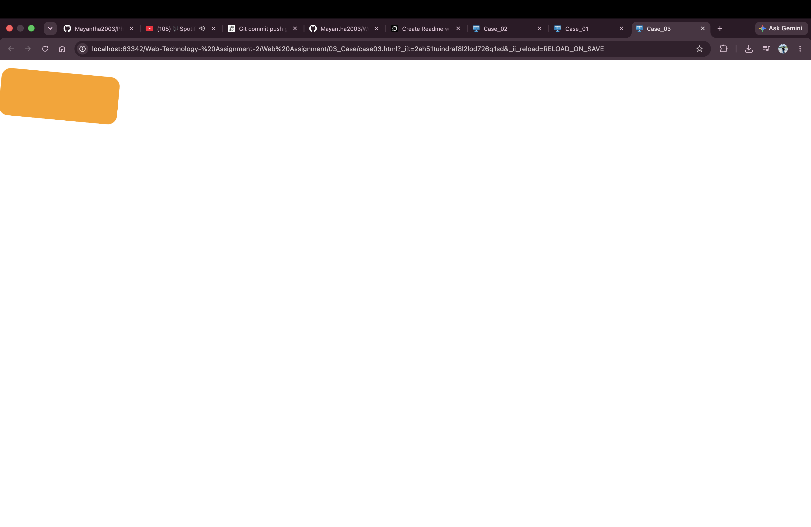
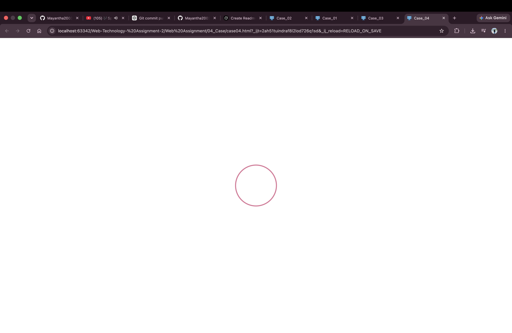
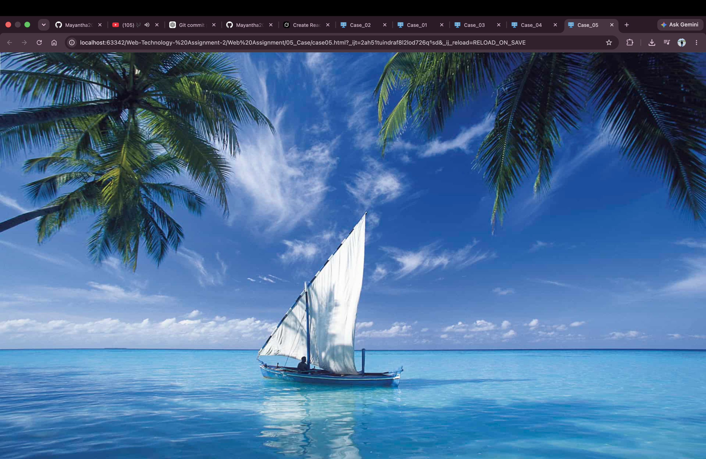
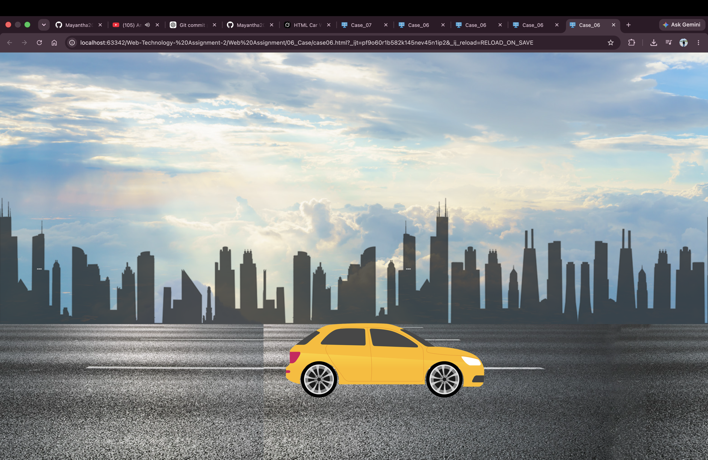
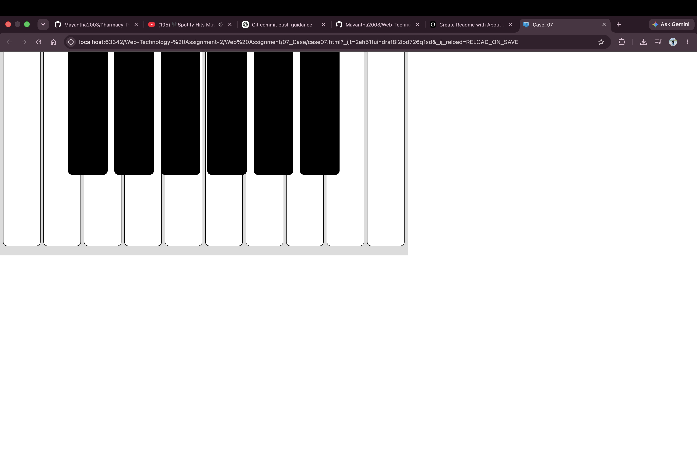

# Web Technology Assignment 2 – CSS Transitions & Animations

IJSE **Web Technology** coursework focused on **CSS transitions**, **animations**, and interactive effects.  
Seven design cases implemented with pure **HTML** and **CSS**.

---

## Cases Overview

| Case | Description | Key CSS concepts |
|------|-------------|------------------|
| **Case 1** | Vertical icon menu – expands on hover to show labels (e.g. “Menu Three”) | `:hover`, `transition`, width expand |
| **Case 2** | Circular badge with “RWAD” text and red arc accent | Border radius, layered shapes |
| **Case 3** | Rotating / tilted orange rectangle animation | `transform: rotate`, animation |
| **Case 4** | Centered circle outline (animated ring) | Border circle, scale / opacity |
| **Case 5** | Full-screen tropical beach background (sailboat scene) | Background image, cover layout |
| **Case 6** | Animated yellow car driving on city road | `@keyframes`, `transform: translate` |
| **Case 7** | CSS piano keyboard (white & black keys) | Nested boxes, absolute positioning |

---

## Screenshots

### Case 1 – Expandable side menu


### Case 2 – Circular RWAD badge


### Case 3 – Rotating rectangle


### Case 4 – Circle outline


### Case 5 – Beach background scene


### Case 6 – Car animation on road


### Case 7 – Piano keys


---

## Tech Stack

| Technology | Usage |
|------------|--------|
| HTML5 | Structure |
| CSS3 | Transitions, animations, transforms |
| Font Awesome | Menu icons (Case 1) |
| Images / assets | Backgrounds (Case 5, Case 6) |

---

## Project Structure

```
Web-Technology- Assignment-2/
└── Web Assignment/
    ├── 01_Case/
    │   └── case01.html
    ├── 02_Case/
    │   └── case02.html
    ├── 03_Case/
    │   └── case03.html
    ├── 04_Case/
    │   └── case04.html
    ├── 05_Case/
    │   └── case05.html
    ├── 06_Case/
    │   └── case06.html
    ├── 07_Case/
    │   └── case07.html
    └── assets/
        ├── lib/normalize.css
        ├── fontawesome/
        └── (images for backgrounds)
```

---

## How to Run

Open any case HTML file in a browser:

```bash
open "Web Assignment/01_Case/case01.html"
```

Or use **Live Server** / IDE preview for hover and animation effects.

---

## Learning Outcomes

- CSS `:hover` transitions
- `transform` (rotate, translate, scale)
- `@keyframes` animations
- Building UI without JavaScript (menu expand, piano, car motion)
- Combining positioning with motion

---

## Author

**G. D. Mayantha (Mayantha Sithum Kaveesha)**  
GitHub: [Mayantha2003](https://github.com/Mayantha2003)

**Institute:** IJSE – Institute of Java & Software Engineering  
**Module:** Web Technology – Assignment 2

---

## License

Educational / coursework project.
